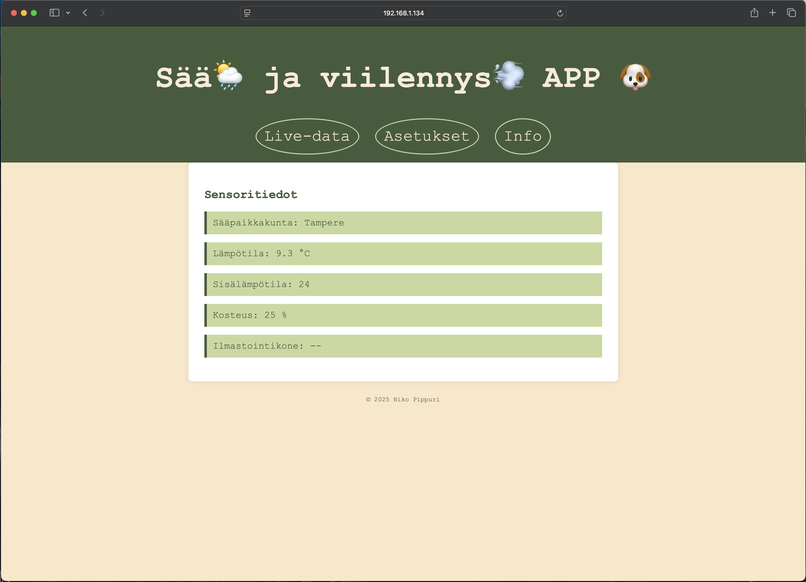
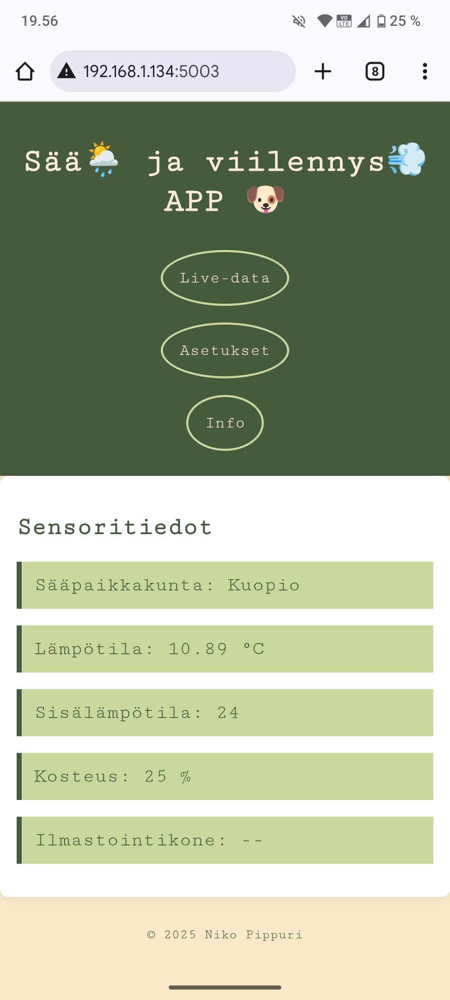
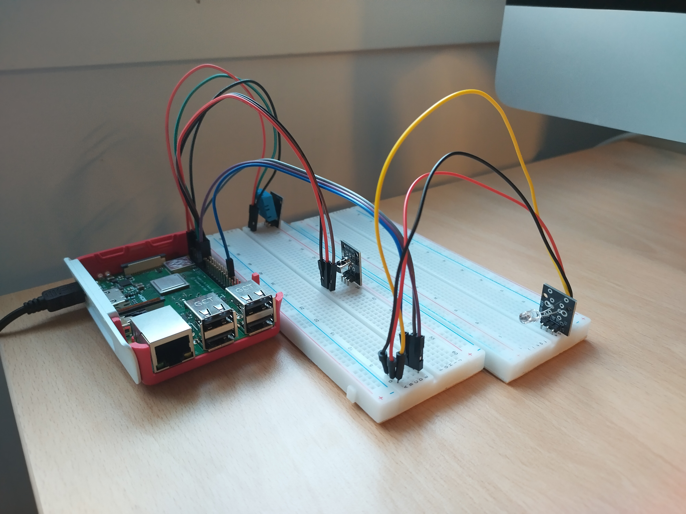

# Weather 🌦️ and cooling 💨 APP 🐶

## ℹ️ About

This project is a browser-based monitoring and control panel that displays real-time temperature and humidity data from a Raspberry Pi device. Users can set a temperature threshold to automatically trigger a cooling system, and view current weather data for a selected city via the OpenWeatherMap API.

The frontend is built with HTML, CSS, and JavaScript, while the backend uses Python and Flask to handle communication between the Raspberry Pi and the browser.

⚠️ This is a work-in-progress prototype and provided as-is. Use at your own risk.

---

## 🛠️ Technologies Used

- 🐍 **Python 3 + Flask** – backend
- 🌐 **HTML + CSS + JavaScript** – frontend
- 🌡️ **DHT11 sensor** – for indoor temperature & humidity
- ☁️ **OpenWeatherMap API** – for real-time weather data
- 🐙 **Raspberry Pi 3 B+** – running the full stack
- 📦 **python-dotenv** – for environment variable management

---

## 🔧 Hardware

-   Raspberry Pi 3 B+

-   DHT11 sensor

-   3Pin KY-022 TL1838 VS1838B 1838 Universal IR Infrared Sensor Receiver Module

-   KY-005 Infrared Transmitter Module

-   Jumper wires

---

## 🔥 Features

- Fetches current **outdoor weather** data for a chosen city
- Reads **indoor temperature and humidity** via GPIO
- Highlights temperature and starts air cooling machine if it exceeds user-defined threshold.
- Saves city and alert limit to **localStorage**
- Simple **responsive UI** accessible via desktop or mobile browser
- `.env` file used to keep API keys secure

---

## 🚧 Getting Started – Instructions Coming Soon

Setup instructions for this project are currently being written.

In a future update, this section will include a complete guide for running the project in a Docker container, along with all necessary configuration steps.

🔗 A link to the Docker setup guide will be provided here when available.

## 📟 Sensor Wiring

| Sensor Pin | Raspberry Pi GPIO      |
|------------|------------------------|
|Tempeture and humidity sensor|
| `+`        | 5V (Pin 2)    |
| `Out (S)`  | GPIO17 (Pin 11)        |
| `-`        | GND (Pin 6)            |
|Infrared receiver|
| `+`        | 3V (Pin 1)    |
| `Out (S)`  | GPIO18 (Pin 12)        |
| `-`        | GND (Pin 14)           |
|Infrared trasmitter|
| `+`        | 5V (Pin 4)    |
| `Out (S)`  | GPIO27 (Pin 13)        |
| `-`        | GND (Pin 34)           |

## 📸 Screenshots

### 🖥️ Desktop

 

### 📱 Mobile

### 🛠️ Prototype

## 📝 License
-   MIT License
    

